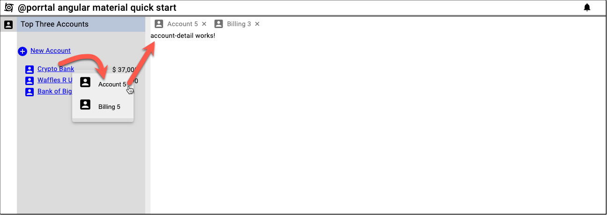

# Create an Entity Menu

### Create `AccountBillingHistory` component in the `account` folder

```bash
ng generate component account/account-billing-history
```

### Create `AccountDetail` component in the `account` folder

```bash
ng generate component account/account-detail
```

### Register `account` "entityType views" in `app.component.ts`

```ts
import { Component } from '@angular/core';
import { BannerData, ShellStateService } from '@porrtal/a-shell';
import { View } from '@porrtal/a-api';

const views: View[] = [
  {
    key: 'AccountNav',
    launchAtStartup: true,
    displayText: 'Account Navigation',
    paneType: 'nav',
    displayIcon: 'account_box',
    componentName: 'AccountNavComponent',
    componentModule: () =>
      import('./account/account-nav/account-nav.component'),
  },
  {
    displayText: 'Create Account',
    displayIcon: 'account_box',
    componentName: 'NewAccountComponent',
    componentModule: () =>
      import('./account/new-account/new-account.component'),
  },
  {
    key: 'Account {accountId}',
    displayText: 'Account {accountId}',
    displayIcon: 'account_box',
    componentName: 'AccountDetailComponent',
    entityType: 'account',
    componentModule: () =>
      import('./account/account-detail/account-detail.component'),
  },
  {
    key: 'Billing {accountId}',
    displayText: 'Billing {accountId}',
    displayIcon: 'account_box',
    componentName: 'AccountBillingHistoryComponent',
    entityType: 'account',
    componentModule: () =>
      import(
        './account/account-billing-history/account-billing-history.component'
      ),
  },
];

@Component({
  selector: 'app-root',
  templateUrl: './app.component.html',
  styleUrls: ['./app.component.css'],
})
export class AppComponent {
  public bannerData: BannerData = {
    displayText: '@porrtal angular material quick start',
    displayIcon: 'cyclone',
  };

  constructor(public shellStateService: ShellStateService) {
    views.forEach((view) =>
      shellStateService.dispatch({
        type: 'registerView',
        view,
      })
    );

    shellStateService.dispatch({
      type: 'launchStartupViews',
    });
  }
}
```

### Update `account-nav.component.html` with the EntityMenu

```html
<div class="container">
  <h3 class="title">Top Three Accounts</h3>
  <div class="new-account-container">
    <span
      class="link-button"
      style="display: grid; grid-template-columns: 24px auto"
      (click)="
        shellStateService.dispatch({
          type: 'launchView',
          viewId: 'NewAccountComponent'
        })
      "
    >
      <mat-icon>add_circle</mat-icon>
      <span style="margin-left: '5px'">New Account</span>
    </span>
  </div>
  <div class="data-container">
    <ng-container *ngFor="let account of topThreeAccounts">
      <porrtal-entity-menu
        entityType="account"
        [state]="{ accountId: account.accountId }"
      >
        <span
          class="link-button"
          style="display: grid; grid-template-columns: 24px auto"
        >
          <mat-icon>account_box</mat-icon>
          <span style="margin-left: 5px">{{ account.name }}</span>
        </span>
      </porrtal-entity-menu>
      <span>
        $
        {{
          account.total
            | number
              : "1.0-0" //.toFixed(0).replace(/(\d)(?=(\d{3})+(?!\d))/g, '$1,')
        }}
      </span>
    </ng-container>
  </div>
</div>
```

### Update `account-nav.component.ts` with EntityMenuComponent import

```ts
import { CommonModule } from '@angular/common';
import { Component, Input } from '@angular/core';
import { EntityMenuComponent } from '@porrtal/a-shell-material';
import { MatIconModule } from '@angular/material/icon';
import { ViewState } from '@porrtal/a-api';
import { Account, accountData } from '../../data/account-data';
import { ShellStateService } from '@porrtal/a-shell';

@Component({
  selector: 'app-account-nav',
  standalone: true,
  imports: [CommonModule, MatIconModule, EntityMenuComponent],
  templateUrl: './account-nav.component.html',
  styleUrls: ['./account-nav.component.css'],
})
export class AccountNavComponent {
  @Input() viewState?: ViewState;

  public topThreeAccounts: (Account & { total: number })[] = [];
  constructor(public shellStateService: ShellStateService) {
    this.topThreeAccounts = [
      ...accountData
        .map((account) => {
          const total = account.orders.reduce((accumulator, order) => {
            return accumulator + order.amount;
          }, 0);
          return {
            ...account,
            total,
          };
        })
        .sort((a, b) => b.total - a.total)
        .filter((acct, ii) => ii < 3),
    ];

    console.log('top three accounts', this.topThreeAccounts);
  }
}
```

### No changes to `AccountNav.css`

```css
.container {
  display: grid;
  grid-template-columns: 1fr;
}

.title {
  background-color: rgb(185, 199, 218);
  margin: 0;
  padding-top: 2px;
  padding-bottom: 2px;
  padding-left: 8px;
  grid-column: 1 / -1;
}

.new-account-container {
  margin-top: 30px;
}

.data-container {
  display: grid;
  grid-template-columns: 1fr auto;
  align-items: center;
  margin-left: 15px;
  margin-right: 15px;
  margin-top: 15px;
}

.link-button {
  color: blue;
  text-decoration: underline;
  cursor: pointer;
}
```

### At this point, we can test the entity menu by clicking on the account in the Account Nav.



## Now we fill in Account Detail implementation

### Update `account-detail.component.css` file in `account` folder

```css
.container {
  display: grid;
  grid-template-columns: 1fr;
}

.title {
  background-color: rgb(185, 199, 218);
  margin: 0;
  padding-top: 2px;
  padding-bottom: 2px;
  padding-left: 8px;
  grid-column: 1 / -1;
}

.data-container {
  display: grid;
  justify-self: start;
  gap: 10px;
  grid-template-columns: auto auto auto;
  margin-left: 15px;
  margin-right: 15px;
  margin-top: 15px;
}

.link-button {
  color: blue;
  text-decoration: underline;
  cursor: pointer;
}
```

### Install `moment` npm package (for date / time functions)

```bash
npm install moment --save --legacy-peer-deps
```

### Update `account-detail.component.html` to show data for the Account

```html
<div class="container">
  <h3 class="title">
    {{ account?.name }} ({{ account?.accountId }}) - Account Detail
  </h3>
  <div class="data-container">
    <ng-container *ngFor="let order of orders">
      <span>{{ order.item }}</span>
      <span>
        {{ order.amountText }}
      </span>
      <span>{{ Moment(order.date).format("YYYY-DD-MM") }}</span>
    </ng-container>
  </div>
</div>
```

### Update `account-detail.component.ts`

```ts
import { Component, Input } from '@angular/core';
import { ViewState } from '@porrtal/a-api';
import { Account, accountData, AccountOrder } from '../../data/account-data';
import * as Moment from 'moment';
import { CommonModule } from '@angular/common';
import { MatIconModule } from '@angular/material/icon';

@Component({
  selector: 'app-account-detail',
  standalone: true,
  imports: [CommonModule, MatIconModule],
  templateUrl: './account-detail.component.html',
  styleUrls: ['./account-detail.component.css'],
})
export class AccountDetailComponent {
  private _viewState?: ViewState;
  @Input() set viewState(value: ViewState | undefined) {
    this._viewState = value;
    if (this._viewState?.state && this._viewState?.state['accountId']) {
      const accountId = this._viewState?.state['accountId'];
      this.account = accountData.find(
        (account) => account.accountId === accountId
      );
      this.orders = [];
      if (this.account) {
        this.orders = this.account.orders.map((order) => ({
          ...order,
          amountText:
            '$' +
            order.amount.toFixed(0).replace(/(\d)(?=(\d{3})+(?!\d))/g, '$1,'),
        }));
      }
    }
  }
  get viewState() {
    return this._viewState;
  }

  public Moment = Moment;
  public account?: Account;
  public orders?: (AccountOrder & { amountText: string })[];
}
```

### Success !! 


