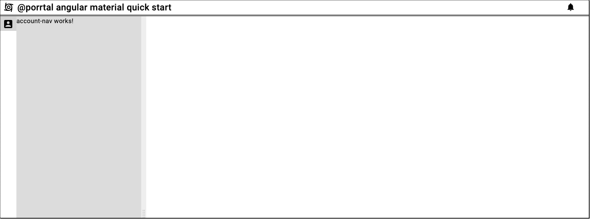

# Create the AccountNav Component

Next, we will turn our generic Angular app into a Porrtal app with a simple Nav view that displays (mock) account data. We will also set the stage for developing with the [Angular Material](https://material.angular.io/) UI library.

## Add Angular Material to the Application

```bash
ng add @angular/material
```

See [Getting Started with Angular Material](https://material.angular.io/guide/getting-started)

## Install npm packages

### Install porrtal npm packages

```bash
npm install @porrtal/a-api @porrtal/a-shell @porrtal/a-shell-material --save --legacy-peer-deps
```

### Install ag-grid npm packages

```bash
npm install ag-grid-community ag-grid-angular --save --legacy-peer-deps
```

### Install @rx-angular/state local state management npm package

```bash
npm install @rx-angular/state --save --legacy-peer-deps --legacy-peer-deps
```

### Install supporting npm packages

```bash
npm install angular-split ngx-popperjs uuid --save --legacy-peer-deps
```

### Install uuid types npm package

```bash
npm install @types/uuid --save-dev --legacy-peer-deps
```

## Create AccountNav Component

```bash
ng generate component account/account-nav
```

## Modify `app.module.ts`

```ts
import { NgModule } from '@angular/core';
import { BrowserModule } from '@angular/platform-browser';

import { AppComponent } from './app.component';
import { BrowserAnimationsModule } from '@angular/platform-browser/animations';
import { AccountNavComponent } from './account/account-nav/account-nav.component';
import { ShellLayoutComponent } from '@porrtal/a-shell-material';

@NgModule({
  declarations: [AppComponent, AccountNavComponent],
  imports: [BrowserModule, BrowserAnimationsModule, ShellLayoutComponent],
  providers: [],
  bootstrap: [AppComponent],
})
export class AppModule {}
```

## Modify `app.component.ts`

```ts
import { Component } from '@angular/core';
import { BannerData, ShellStateService } from '@porrtal/a-shell';
import { View } from '@porrtal/a-api';

const views: View[] = [
  {
    key: 'AccountNav',
    launchAtStartup: true,
    displayText: 'Account Navigation',
    paneType: 'nav',
    displayIcon: 'account_box',
    componentName: 'AccountNavComponent',
    componentModule: () =>
      import('./account/account-nav/account-nav.component'),
  },
];

@Component({
  selector: 'app-root',
  templateUrl: './app.component.html',
  styleUrls: ['./app.component.css'],
})
export class AppComponent {
  public bannerData: BannerData = {
    displayText: '@porrtal angular material quick start',
    displayIcon: 'cyclone',
  };

  constructor(public shellStateService: ShellStateService) {
    views.forEach((view) =>
      shellStateService.dispatch({
        type: 'registerView',
        view,
      })
    );

    shellStateService.dispatch({
      type: 'launchStartupViews',
    });
  }
}
```

## Modify `app.component.html`

```html
<porrtal-shell-layout [bannerData]="bannerData"></porrtal-shell-layout>
```

## Run the app

Open a terminal window, change into the application folder, and run this command:

```bash
npm start
```

## Success !!  Porrtal with your AccountNav View



# Next Let's Add Detail to the Account Nav Component

## Create some mock Account data

Create a folder `data` at the same level as `app.component.ts`

Create a file `account-data.ts` in the `data` folder.

```ts
export interface AccountOrder {
    date: number;
    item: string;
    amount: number;
  }
  
  export interface Account {
    accountId: number;
    name: string;
    orders: AccountOrder[];
  }
  
  export const accountData = [
  {
    accountId: 1,
    name: 'Bank of Big Money',
    orders: [
      {
        date: Date.now(),
        item: 'Screen design',
        amount: 1000,
      },
      {
        date: Date.now() + 1000 * 60 * 60 * 24 * 5,
        item: 'Screen development',
        amount: 5000,
      },
      {
        date: Date.now() + 1000 * 60 * 60 * 24 * 10,
        item: 'Screen testing',
        amount: 3000,
      },
    ],
  },
  {
    accountId: 2,
    name: 'Bill Jones',
    orders: [
      {
        date: Date.now(),
        item: 'Slide development',
        amount: 1000,
      },
    ],
  },
  {
    accountId: 3,
    name: 'Waffles R Us',
    orders: [
      {
        date: Date.now(),
        item: 'Screen design',
        amount: 2000,
      },
      {
        date: Date.now() + 1000 * 60 * 60 * 24 * 5,
        item: 'Screen development',
        amount: 8000,
      },
      {
        date: Date.now() + 1000 * 60 * 60 * 24 * 10,
        item: 'Screen testing',
        amount: 5000,
      },
    ],
  },
  {
    accountId: 4,
    name: 'Waffle House',
    orders: [
      {
        date: Date.now(),
        item: 'Screen design',
        amount: 500,
      },
      {
        date: Date.now() + 1000 * 60 * 60 * 24 * 5,
        item: 'Screen development',
        amount: 2000,
      },
    ],
  },
  {
    accountId: 5,
    name: 'Crypto Bank',
    orders: [
      {
        date: Date.now(),
        item: 'Slide work',
        amount: 1000,
      },
      {
        date: Date.now() + 1000 * 60 * 60 * 24 * 5,
        item: 'Computer order',
        amount: 15000,
      },
      {
        date: Date.now() + 1000 * 60 * 60 * 24 * 10,
        item: 'Programming',
        amount: 21000,
      },
    ],
  },
];
```

## Update `account-nav.component.html`

```html
<div class="container">
  <h3 class="title">Top Three Accounts</h3>
  <div class="data-container">
    <ng-container *ngFor="let account of topThreeAccounts">
      <span
        class="link-button"
        style="display: grid; grid-template-columns: 24px auto"
      >
        <mat-icon>account_box</mat-icon>
        <span style="margin-left: 5px">{{ account.name }}</span>
      </span>
      <span>
        $
        {{
          account.total
            | number
              : "1.0-0" //.toFixed(0).replace(/(\d)(?=(\d{3})+(?!\d))/g, '$1,')
        }}
      </span>
    </ng-container>
  </div>
</div>
```

## Update `account-nav.component.css`

```css
.container {
  display: grid;
  grid-template-columns: 1fr;
}

.title {
  background-color: rgb(185, 199, 218);
  margin: 0;
  padding-top: 2px;
  padding-bottom: 2px;
  padding-left: 8px;
  grid-column: 1 / -1;
}

.data-container {
  display: grid;
  grid-template-columns: 1fr auto;
  align-items: center;
  margin-left: 15px;
  margin-right: 15px;
  margin-top: 15px;
}

.link-button {
  color: blue;
  text-decoration: underline;
  cursor: pointer;
}
```

## Update `account-nav.component.ts`

```ts
import { CommonModule } from '@angular/common';
import { Component, Input } from '@angular/core';
import { EntityMenuComponent } from '@porrtal/a-shell-material';
import { MatIconModule } from '@angular/material/icon';
import { ViewState } from '@porrtal/a-api';
import { Account, accountData } from '../../data/account-data';

@Component({
  selector: 'app-account-nav',
  standalone: true,
  imports: [CommonModule, MatIconModule, EntityMenuComponent],
  templateUrl: './account-nav.component.html',
  styleUrls: ['./account-nav.component.css'],
})
export class AccountNavComponent {
  @Input() viewState?: ViewState;

  public topThreeAccounts: (Account & { total: number })[] = [];
  constructor() {
    this.topThreeAccounts = [
      ...accountData
        .map((account) => {
          const total = account.orders.reduce((accumulator, order) => {
            return accumulator + order.amount;
          }, 0);
          return {
            ...account,
            total,
          };
        })
        .sort((a, b) => b.total - a.total)
        .filter((acct, ii) => ii < 3),
    ];

    console.log('top three accounts', this.topThreeAccounts);
  }
}
```

## Update `app.module.ts`

```ts
import { NgModule } from '@angular/core';
import { BrowserModule } from '@angular/platform-browser';
import { AppComponent } from './app.component';
import { BrowserAnimationsModule } from '@angular/platform-browser/animations';
import { ShellLayoutComponent } from '@porrtal/a-shell-material';

@NgModule({
  declarations: [AppComponent],
  imports: [BrowserModule, BrowserAnimationsModule, ShellLayoutComponent],
  providers: [],
  bootstrap: [AppComponent],
})
export class AppModule {}
```

## AccountNav View with Account Data


