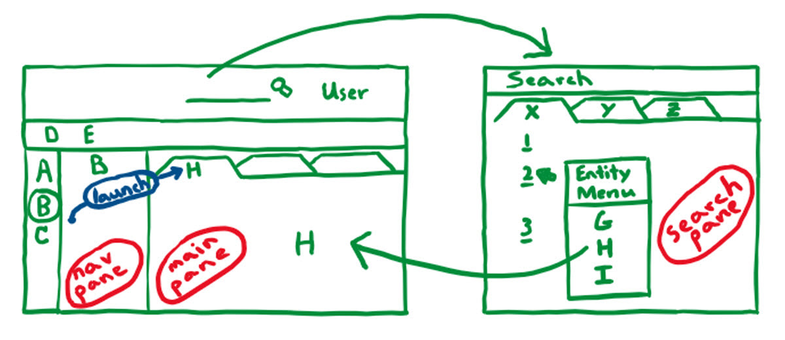

# Welcome to the Porrtal quick-start for React using the Blueprint UI Library

## Other quick-start Options

[Porrtal quick-start for React using the Material UI (MUI) Library](/react/quick-start?reactUiLibrary=mui)

[Porrtal quick-start for Angular using the Material UI Library](/angular/quick-start)

## What are We Building

Lets start with an overview of what we will build in the quick-start. The goal is to quickly get a React app up and running using the Porrtal libraries.

Here is an overview of a Porrtal app and how you plug in your components:

Several Porrtal "Panes" ("nav" pane, "main" pane, and "search" pane) are shown in the above diagram. These are the regions where your React components can be placed.

React components are independent and reusable bits of code that typically occupy a rectangular area of the UI.

When building a Porrtal app, you will define an array of Porrtal "Views". Each Porrtal View object in the array references one of your React components. The View object also includes properties like icon, display text, pane, and more. The View object helps Porrtal load your components into the Porrtal app.

The text you are reading now is located in the main pane. There is a React component displaying this markdown file.

On the left, you can see the nav pane. The first nav view is the quick start outline. The second is the Account Nav component we will be building. You can switch between these components by clicking on the icons on the far left.

To see the search pane, start typing some text in top right text box. The search pane will popup and show the results of the search based on the text you type. As you change the text, the search component will change the displayed results.

A Porrtal view can be dynamically launched by the code in a component. We will see this in action shortly. We will also see a more advanced Porrtal view launch feature where an (entity) menu of launch options is displayed.

We will build up the application one step at a time by following this topic sequence:

1. Setup Your Workstation
2. Create the App
3. Create the Account Nav Component
4. Launch a Component
5. Create an Entity Menu
6. Create a Search Component
7. Next Steps
