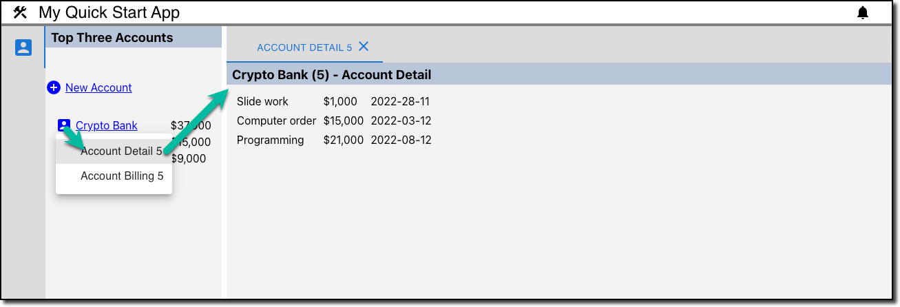

# Create an Entity Menu

### Create `AccountBilling.tsx` file in `Account` folder

```tsx
export function AccountBilling() {
    return (<div>Account Billing</div>);
}

export default AccountBilling;
```

### Create `AccountDetail.tsx` file in `Account` folder

```tsx
export function AccountDetail() {
    return (<div>Account Detail</div>);
}

export default AccountDetail;
```

### Register AccountBilling and AccountDetail views in `App.tsx`

There may be times when you would like the text in the entity menu to be different from the text displayed in the 
tab for the view.  An example of this is shown for the Account view in the following code.  Notice that the 
Billing view does not define entityTypeMenuText, so displayText is used for its entity menu.

```tsx
import { View } from "@porrtal/r-api";
import { BannerData, ShellState } from "@porrtal/r-shell";
import { ShellMaterial } from "@porrtal/r-shell-material";

import "./App.css";

function App() {
  const porrtalViews: View[] = [
    {
      key: "AccountNav",
      launchAtStartup: true,
      displayText: "Account Navigation",
      paneType: "nav",
      displayIcon: "account_box",
      componentName: "AccountNav",
      componentModule: () => import("./Account/AccountNav"),
    },
    {
      viewId: "NewAccount",
      key: "NewAccount",
      displayText: "New Account",
      paneType: "main",
      displayIcon: "add",
      componentName: "NewAccount",
      componentModule: () => import("./Account/NewAccount"),
    },
    {
      viewId: "Account",
      key: 'Account {accountId}',
      displayText: 'Account {accountId}',
      entityTypeMenuText: 'Acct {accountId}',
      paneType: "main",
      displayIcon: "mugshot",
      componentName: "AccountDetail",
      entityType: "account",
      componentModule: () => import("./Account/AccountDetail"),
    },
    {
      viewId: "Billing",
      key: 'Billing {accountId}',
      displayText: 'Billing {accountId}',
      paneType: "main",
      displayIcon: "mugshot",
      componentName: "AccountBilling",
      entityType: "account",
      componentModule: () => import("./Account/AccountBilling"),
    },
  ];
  const porrtalBanner: BannerData = {
    displayText: "My Quick Start App",
    displayIcon: "construction",
    childData: []
  };
  return (
    <ShellState views={porrtalViews}>
      <ShellMaterial bannerData={porrtalBanner} />
    </ShellState>
  );
}

export default App;
```

### Update `AccountNav.tsx` with the EntityMenu

```tsx
import { Icon } from "@mui/material";
import { EntityMenu, useShellDispatch } from "@porrtal/r-shell";
import { Fragment } from "react";
import { accountData } from "../Data/AccountData";
import "./AccountNav.css";

/* eslint-disable-next-line */
export interface AccountNavProps {}

export function AccountNav(props: AccountNavProps) {
  const shellDispatch = useShellDispatch();
  return (
    <div className="AccountNav_container">
      <h3 className="AccountNav_title">Top Three Accounts</h3>
      <div className="AccountNav_new-account-container">
        <p
          className="AccountNav_link-button"
          onClick={() =>
            shellDispatch({ type: "launchView", viewId: "NewAccount" })
          }
        >
          <Icon>add_circle</Icon>
          <span style={{ marginLeft: "5px" }}>New Account</span>
        </p>
      </div>
      <div className="AccountNav_data-container">
        {accountData
          .map((account) => {
            const total = account?.orders.reduce((accumulator, order) => {
              return accumulator + order.amount;
            }, 0);
            return {
              ...account,
              total,
            };
          })
          .sort((a, b) => b.total - a.total)
          .filter((acct, ii) => ii < 3)
          .map((acct) => {
            return (
              <Fragment key={acct.accountId}>
                <EntityMenu
                  entityType="account"
                  state={{ accountId: acct.accountId }}
                >
                  <span className="AccountNav_link-button">
                    <Icon>account_box</Icon>
                    <span style={{ marginLeft: "5px" }}>{acct.name}</span>
                  </span>
                </EntityMenu>
                <span>
                  {"$" +
                    acct.total
                      .toFixed(0)
                      .replace(/(\d)(?=(\d{3})+(?!\d))/g, "$1,")}
                </span>
              </Fragment>
            );
          })}
      </div>
    </div>
  );
}

export default AccountNav;
```

### Update `AccountNav.css`

```css
.AccountNav_container {
  display: grid;
  grid-template-columns: 1fr;
}

.AccountNav_title {
  background-color: rgb(185, 199, 218);
  margin: 0;
  padding-top: 5px;
  padding-bottom: 4px;
  padding-left: 8px;
  grid-column: 1 / -1;
}

.AccountNav_new-account-container {
  margin-top: 30px;
}

.AccountNav_data-container {
  display: grid;
  grid-template-columns: 1fr auto;
  align-items: center;
  margin-left: 15px;
  margin-right: 15px;
  margin-top: 15px;
}

.AccountNav_link-button {
  color: blue;
  text-decoration: underline;
  cursor: pointer;
  display: grid;
  grid-template-columns: auto auto 1fr;
  justify-items: flex-end;
  align-items: center;
}
```

### At this point, we can test the entity menu by clicking on the account in the Account Nav.

## Now we fill in Account Detail implementation

Next we will add detail to the Account Details page, picking up the accountId from the `state` property in the `viewState` property.

### Add `AccountDetail.css` file in `Account` folder

```css
.AccountDetail_container {
  display: grid;
  grid-template-columns: 1fr;
}

.AccountDetail_title {
  background-color: rgb(185, 199, 218);
  margin: 0;
  padding-top: 5px;
  padding-bottom: 4px;
  padding-left: 8px;
  grid-column: 1 / -1;
}

.AccountDetail_data-container {
  display: grid;
  justify-self: start;
  gap: 10px;
  grid-template-columns: auto auto auto;
  margin-left: 15px;
  margin-right: 15px;
  margin-top: 15px;
}

.AccountDetail_link-button {
  color: blue;
  text-decoration: underline;
  cursor: pointer;
}
```

### Install `moment` npm package (for date / time functions)

```bash
npm install moment --save 
```

### Update `AccountDetail.tsx` to show data for the Account

```tsx
import { ViewComponentProps } from "@porrtal/r-api";
import { Fragment } from "react";
import { accountData } from "../Data/AccountData";
import "./AccountDetail.css";
import Moment from "moment";

export function AccountDetail(props: ViewComponentProps) {
  const account = accountData.find(
    (acct) => acct.accountId === props.viewState?.state?.["accountId"]
  );

  if (account === null) {
    return (
      <div>
        <span>accountId:&nbsp;</span>
        <span>{`${props.viewState?.state?.["accountId"]}`}</span>
        <span>&nbsp;not found.</span>
      </div>
    );
  }

  return (
    <div className="AccountDetail_container">
      <h3 className="AccountDetail_title">
        {account?.name} ({account?.accountId}) - Account Detail
      </h3>
      <div className="AccountDetail_data-container">
        {account?.orders.map((order, index) => (
          <Fragment key={index}>
            <span>{order.item}</span>
            <span>
              {"$" +
                order.amount
                  .toFixed(0)
                  .replace(/(\d)(?=(\d{3})+(?!\d))/g, "$1,")}
            </span>
            <span>{Moment(order.date).format("YYYY-DD-MM")}</span>
          </Fragment>
        ))}
      </div>
    </div>
  );
}

export default AccountDetail;
```

### Success !! 


